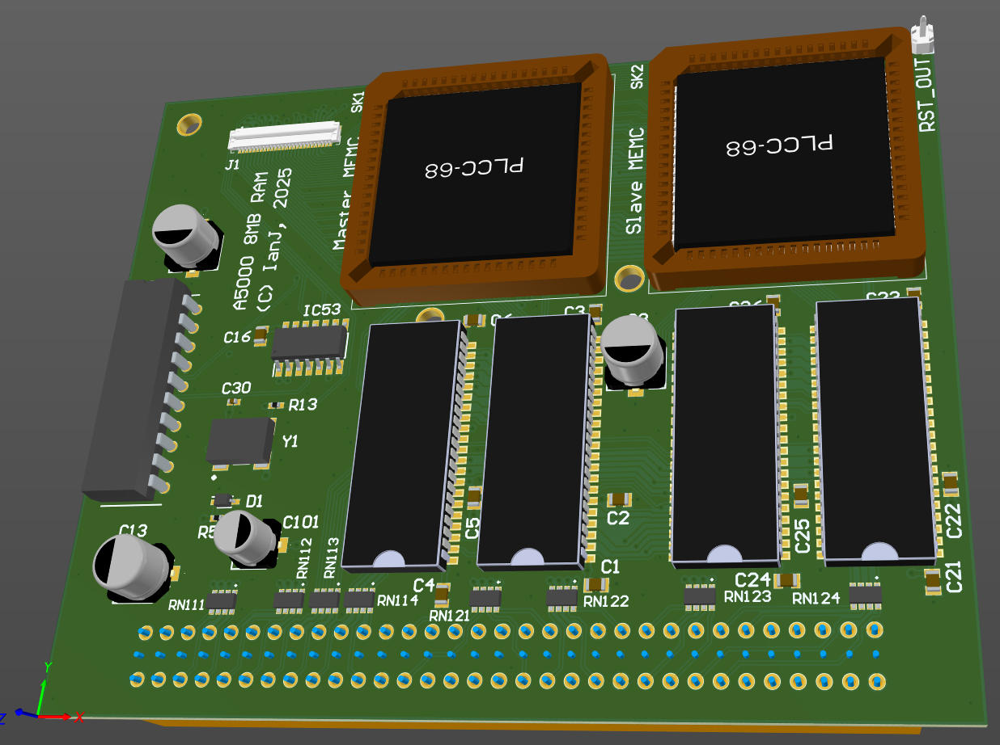

# A5000 8MB

April 2023

An 8MB board for Acorn A5000.  Disconnects all the motherboard RAM so can be used on any A5000, even one with no RAM on board.
Uses my MEMC_Plug_FFC adapter and FFC for MEMC connection, purely to account for variability of positioning of the MEMC socket on the motherboard.
In common with other 8MB upgrades, it does require a MEMC socket on the motherboard - so either an 'Alpha' variant board, or one where the MEMC has been socketed after market.
Because the onboard RAM is not used, this board provides its own clock to allow the MEMCs to be overclocked and the RAM run at 20MHz or greater - a noticable performance boost from the stock 12MHz RAM on the motherboard.

This has NOT been built or tested.

## Licence

No warranty is provided, and this work is used at your own risk.  

Licenced as CC BY-SA 3.0

Copyright 2023 Ian Jeffray

