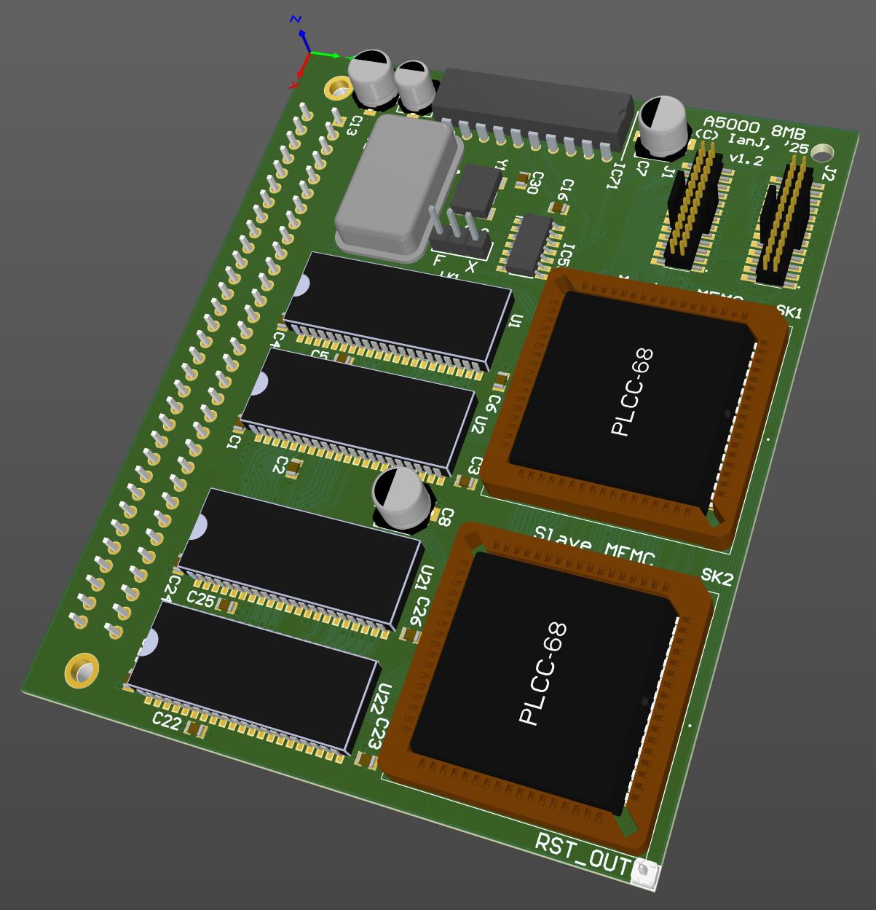

# A5000 8MB

December 2025

An 8MB board for Acorn A5000.  Disconnects all the motherboard RAM so can be used on any A5000, even one with no RAM on board.
Uses my MEMC_Dual_IDCs or MEMC_Plug_Dual_IDCs adapter and a pair of short 1.27mm 26 way IDC cables for MEMC connection, purely to account for variability of positioning of the MEMC socket on the motherboard.
In common with other 8MB upgrades, it does require either a MEMC socket on the motherboard - so either an 'Alpha' variant board, or one where the MEMC has been socketed after market - or soldering of the MEMC_Dual_IDCs board directly to the motherboard.
Because the onboard RAM is not used, this board provides its own clock to allow the MEMCs to be overclocked and the RAM run at 20MHz or greater - a noticable performance boost from the stock 12MHz RAM on the motherboard.

Due to the PAL design being simply lifted from the A540, one track cut (between IC5 pin 2 and its close-by via) and one fine patch wire (from this board to the via right next to ARM3 reset pin 32) may be required for most reliable start up - holding-off reset to the ARM3 until the MEMC sync process is complete.  In practice, this hasn't been required so far.

The 1.0 design has been built and tested up to 50MHz (16.66MHz RAM) - there was one design fault with DBE not tracked to the MEMC connector, requiring a tricky cut and strap fix - this was corrected in the 1.1 design which has NOT yet been built/tested.  The 1.1 design also adds a manual moveable link for clock selection internal / external so that the onboard overclock oscillator may be left populated and only activated when desired.  A further update as version 1.2 replaces the original FFC connector with the pair of 26 way IDCs for easier soldering and cabling.  A position for a DIP oscillator/socket was also added to accommodate easier tweaking of the clock speed and more SMT components were moved to the bottom side with the plan that a single-side load SMT assembly of jellybean parts may be undertaken.  The 1.2 design has NOT yet been built or tested.

## Licence

No warranty is provided, and this work is used at your own risk.  

Licenced as CC BY-SA 4.0

Copyright 2025 Ian Jeffray

